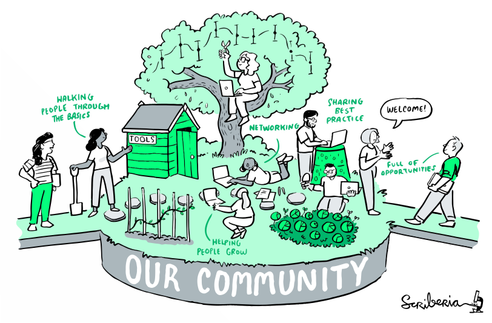

# Welcome
_"But what are reseach groups". This is our big question. We seek to define and characterize research groups in a practical way while staying open to philosophical pendantry._

This is an experimental project that seek to combine (some) data collection, data analysis, model building, and model visualization under the same roof. We believe in the philosophy of principled data processing (see [the-turing-way](https://book.the-turing-way.org/),and [Patrick Ball: Principled Data Processing](https://www.youtube.com/watch?v=ZSunU9GQdcI&t=2923s&pp=ygURcGF0cmljayBiYWxsIGRhdGE%3D) for the details), but that is augmented with a modern data visualization framework (aka [Observable Framework](https://observablehq.com/framework/)).

This project is for (i) anybody sharing the same goals of reproducible science or (ii) people interested in the science of science of groups. 

## The philosophy of research groups

 <figure>
  
  <figcaption>Fig. 142 The Turing Way community illustrated as a garden. The Turing Way project illustration by Scriberia. Used under a CC-BY 4.0 licence. DOI: 10.5281/zenodo.3332807.</figcaption>
</figure> 

Free and open-source software (F/OSS) is changing how researchers collaborate on projects. As individuals increasingly rely on F/OSS, they are confronted on learning different tools and skills such as version control, interacting with API, or building principled data pipelines that are robust yet extensible. Learning about all of this can be scary. A solution to survive the process, once again, are communities.

In the project, we will include and exclude people from groups. Sometime this will feel unfair, as people will get excluded for seemingly arbitrary reasons. Truth be told, as research groups emerge and thrive, I think they become like the figure above; a loose network of people that can have a more or less central cores. That being said, in current academia, many research groups are characterized by one or few principal investigators (PIs) that tied together a bunch of students under the same roof. 

When we are lucky, there is a public facing webpage hosted by the group/PI that says, "look, here is my lab". This will be the people we define as part of the group, even thoug some loose collaborators might be missing from that page. We assume that this approach is a good proxy to get who is on the payroll of the lab, or at least who benefit from being exhibited on the main page of the lab.


## Project philosophy

We are gonna build a collection of dashboards tied together by a common theme, that is, _characterizing research groups in science_. Similar to [Andy Matuschak's Evergreen Notes](https://notes.andymatuschak.org/Evergreen_notes), the central idea is to keep together a family of dashboards that will accumulate over time and across projects. By analogy with Evergreen notes, each dashboard ought to be atomic, and 'concept-oriented' (answering a single question).

Note that it is easier to have many apps representing the data in different ways these days, thanks the [observable framework](https://observablehq.com/framework/what-is-framework) code design. Any observable project is basically a static site, for data apps. So one of the goals is to see if it works to create a new tab for each new way one could visualize the entire project. There is a chance it might gets out of hand, but I think if the data pipeline is well designed and it has the potential to scale up.

One reason not to do what we are about to do is _modularity_. Wouldn't be better to have the app living as a separate module? Then, the data wouldn't be tied to a single dashboard. It is possible, but one needs to overcome the following challenges:

- `Linking the data and the app:` One reason my dashboards end up dead is by forgetting where the data comes from. Then the app become frozen for eternity, as I simply move on to other projects. Wouldn't be better to have the app and the data pipeline coexisting under the same repo? 
- ...

## Project structure

We take as starting point the observable framework structure, but modify it a little to accomodate our data processing pipeline. The main difference is about how we think about `data/`, which we reserve for the raw/import data. The data loader that is expected by the app is instead contained under `output/`. This is the data that when modified, the app will update automatically. `output/`

<details><summary>How to get started with Observable Framework</summary>

## 

This is (also) an [Observable Framework](https://observablehq.com/framework) project. To start the local preview server, run:

```
npm run dev
```

Then visit <http://localhost:3000> to preview your project.

For more, see <https://observablehq.com/framework/getting-started>.

#### Project structure

A typical Framework project looks like this:

```ini
.
├─ docs
│  ├─ components
│  │  └─ timeline.js           # an importable module
│  ├─ output
│  │  ├─ launches.csv.js       # a data loader
│  │  └─ events.json           # a static data file
│  ├─ example-dashboard.md     # a page
│  ├─ example-report.md        # another page
│  └─ index.md                 # the home page
├─ .gitignore
├─ observablehq.config.js      # the project config file
├─ package.json
└─ README.md
```

**`docs`** - This is the “source root” — where your source files live. Pages go here. Each page is a Markdown file. Observable Framework uses [file-based routing](https://observablehq.com/framework/routing), which means that the name of the file controls where the page is served. You can create as many pages as you like. Use folders to organize your pages.

**`docs/index.md`** - This is the home page for your site. You can have as many additional pages as you’d like, but you should always have a home page, too.

**`docs/data`** - You can put [data loaders](https://observablehq.com/framework/loaders) or static data files anywhere in your source root, but we recommend putting them here.

**`docs/components`** - You can put shared [JavaScript modules](https://observablehq.com/framework/javascript/imports) anywhere in your source root, but we recommend putting them here. This helps you pull code out of Markdown files and into JavaScript modules, making it easier to reuse code across pages, write tests and run linters, and even share code with vanilla web applications.

**`observablehq.config.js`** - This is the [project configuration](https://observablehq.com/framework/config) file, such as the pages and sections in the sidebar navigation, and the project’s title.

#### Command reference

| Command           | Description                                              |
| ----------------- | -------------------------------------------------------- |
| `npm install`            | Install or reinstall dependencies                        |
| `npm run dev`        | Start local preview server                               |
| `npm run build`      | Build your static site, generating `./dist`              |
| `npm run deploy`     | Deploy your project to Observable                        |
| `npm run clean`      | Clear the local data loader cache                        |
| `npm run observable` | Run commands like `observable help`                      |

##

</details>

