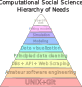

# What is the computational turn?

  <figure class="gallery">
    <picture>
      <source srcset="./assets/jurafsky_comp_ling.webp" media="(prefers-color-scheme: dark)">
      
    </picture>
    <figcaption><a href="https://www.ideals.illinois.edu/items/11601/bitstreams/42397/data.pdf">Linguists are talking about computers. What's up with that?</a> Other references thinking out loud about this shift are this one on <a href="https://aclanthology.org/C96-2171.pdf">the use of computational linguistics in the real word</a><a href="https://www.dam.brown.edu/people/mumford/beyond/papers/2000b--DawningAgeStoch-NC.pdf">and Mumford's paper on The Dawning of the Age of Stochasticity</a></figcaption>
  </figure>
  <figure class="gallery">
    <picture>
      <source srcset="./assets/css_is_sus.webp" media="(prefers-color-scheme: dark)">
      
    </picture>
    <figcaption>A field in which social scientists use computers? Sounds sus?</figcaption>
  </figure>

Why make a big deal of scientists using computers? 
We will see that there are many reasons. 
But first, as both of the authors above know, this is not really about computers. 
This is about what computers and computer programming mean for different communities. 

In linguistics, computational methods are tied to a worldview about the study of languages.
Say that you want to become a professor of linguistics in the 1990s. 
As with other fields in the humanities, you learn to speak the native language.
For instance, you might need to speak fluently in Chomsky's transformational-generative grammar, which states that grammar is a system of 'transformations', or processes, that specify the possible combinations of words in a sentence.
By having a good grasp of these transformations, you can demonstrate to your peers that you are part of the tribe, potentially leading to a position in a linguistic department.

In his paper, Jurasky mentions that the use of computers as tools does not really change the above. Using computer softwares to do phonetics or transcribe conversation doesn not change the worldview of linguistics. 

Computers pose problem when they introduce competing statistical methods to established linguistic theories that are successful due to their usefulness in industry.
The debate is epitomized by the dispute between Peter Norvig, now director of research at Google, and Chomsky, on whether statistical theory are providing any _theoretical_ insight into language. 
Chomsky (in)famously stated that statistical theories were kind of pointless to understand language because they fail to be mechanistic, unlike his theories (see [this transcript](http://languagelog.ldc.upenn.edu/myl/PinkerChomskyMIT.html)). 
This idea is at the heart of why the computational turn is more than just about computers. 
In many sciences, computational methods (often) do not reflect established theories thought to explain the phenomena by the natives but are still deemed successful, partly because success is defined by stakeholders outside the field.

By changing what is deemed successful, the rise of computational works produce an alternative stable state, as we will describe in the chapter on [computational hysteresis](./hysteresis.md). Going back to our linguistic example, doing a PhD in linguistics in the Chomskian world involved developing a thesis about tge fundamental properties of language, formulated with the vocabulary established in linguistics. Doing a PhD in linguistics in Norvig's world would involve splitting your time between learning enough linguistics to get you started, but also enough programming skills to wield larger corpora and do large scale analysis, typically useful to the tech industry that emerged with the informational era. 

Linguistics is not alone in that situation, albeit they might have been amongst the first in the humanities to undertake this transition. Philosophy, journalism, literature, anthropology all followed suit in the last 20 years. The same phenomenon is happenning in the experimental sciences, such as psychology, ecology, or biomedical engineering, where we observe a shift in which domain-specialists are somehow pressured to learn computer programming for various reasons. 

## Why study the computational turn?

Arguably, the following are good enough reasons to study the computational turn:

 - `Diversity in science`: it matters who do the science. If a science is becoming more male-dominated as a result of a computational turn, we should do something about it. There are reasons to believe this is the case.
 - `Reproducibility and transparency in science`: people who are not interested in good software engineering practice won't write code that is reproducible or transparent. 
 - `Reducing the suffering when dabbling with code`: writing dirty code is easy, writing code that your future selves and others will want to engage with is hard. If there is a lack of community when individual engage with computational works, it can have strong negative impact on individuals. Especially when individuals don't have a background in computing and engage reluctantly with ccomputaional works.
 - `Diversity in the tech industry`: it matters who build the tools that impact the scoiety at large. It is not enough to have oversight, we need a diversity of people in the tech industry as well at the level of software engineers. To get there, we need people from different socioeconomic and academic backgrounds that enter in the tech industry.

The computational turn has many benefits, but here we note the other side of the coin from a humanist perspective:

    
<h2>Dr Jekyll</h2>
        <li>Computational approach makes maths anb stats easier, sometimes even irrelevant.</li> 
        <li></li>
    

    
<h2>Mr Hyde</h2>
        <li>Fields are can potentially becoming naturalized, which means they are more mathy. This can come with its own issues when the fields care about phenomenology, or the lived experience.</li>
        <li></li>
    

## What makes the computational turn 'computational'

<figure class="wide">
  <picture>
    <source srcset="./assets/maslow.svg" media="(prefers-color-scheme: dark)">
    
  </picture>
  <figcaption>One potential hierarchy of needs for computational social scientists. By amateur software engineering, we mean testing code, making it shareable and readble, or make it performant. By principled data cleaning, we mean how to clean code in such a way you actually introduce bugs in your cleaning process, and your cleaning process will be reproducible on the long run. To be fair, this is the hierarchy of needs to computational social scientists who work with observational data. The hierarchy ought to differ for experimentalists or theoreticians, but there will be overlap.</figcaption>
</figure>

## A little prehistory of computer science

Computer science is one of the only STEM fields that was more gender balanced at its inception than in more recent years.

- [My Mother Was a Computer (2005)](https://press.uchicago.edu/ucp/books/book/chicago/M/bo3622698.html)
- [When Computers Were Human (Sept 2007)](https://press.princeton.edu/books/paperback/9780691133829/when-computers-were-human)
- [Coding Freedom: The Ethics and Aesthetics of Hacking (2012)](https://press.princeton.edu/books/paperback/9780691144610/coding-freedom)
- [Programmed Inequality (2018)](https://mitpress.mit.edu/9780262535182/programmed-inequality/)
- [The Gendered History of Human Computers (June 2019)](https://www.smithsonianmag.com/science-nature/history-human-computers-180972202/)
- [The Secret History of Women in Coding (June 2019)](https://www.nytimes.com/2019/02/13/magazine/women-coding-computer-programming.html)
- [Coders: Who They Are, What They Think and How They Are Changing Our World (2019)](https://books.google.ca/books/about/Coders.html?id=q72OEAAAQBAJ&source=kp_book_description&redir_esc=y)
- [The Impact of Women in Computer Science History: A Post-War American History (June 2019)](https://www.cs.ubc.ca/~mochetti/files/journal02.pdf)
- [Women in Computing (May 2020)](https://www.sciencemuseum.org.uk/objects-and-stories/women-computing)
- [Changing the Curve: Women in Computing (2021)](https://ischoolonline.berkeley.edu/blog/women-computing-computer-science/)
- [There Are Too Few Women in Computer Science and Engineering (2022)](https://www.scientificamerican.com/article/there-are-too-few-women-in-computer-science-and-engineering/)

## A little history of computational X

### Computational Physics

The computational turn in Physics was barely noticeable. For physicists, it was about using computers to do computation, thus computational physics. It was more about the pitfalls of numerical methods, and how to write efficient code, than promoting F/OSS. That said, in some parts of physics, early on there was also the realization tha computers were more than computations; it was about sharing code, data, analysis, reproducibility, etc. 

 - [Computational Physics (2013)](https://public.websites.umich.edu/~mejn/cp/)
 - [Python for Astronomers (2014)](http://ugastro.berkeley.edu/pydecal/textbook.pdf)

### Computational linguistics

The computational turn in linguistics was perhaps one of the most acrimonious divorce.

 - [Computational Linguistics, Volume 19, Number 1, March 1993, Special Issue on Using Large Corpora: I](https://aclanthology.org/J93-1000.pdf)
 - [Computational Linguistics and its Use in Real World:
the Case of Computer Assisted-Language Learning](https://aclanthology.org/C96-2171.pdf)
 - [LINGUISTICS IN A COMPUTATIONAL WORLD](https://www.ideals.illinois.edu/items/11601/bitstreams/42397/data.pdf)

### Computational Journalism

 - [11.3: Computational Journalism](https://socialsci.libretexts.org/Bookshelves/Communication/Journalism_and_Mass_Communication/The_American_Journalism_Handbook_-_Concepts_Issues_and_Skills_(Zamith)/11%3A_Future_of_Journalism/11.03%3A_Computational_Journalism)

### Computational Ecology

- [Computational ecology as an emerging science(2012)](https://royalsocietypublishing.org/doi/10.1098/rsfs.2011.0083)

### Computational Finance 

- [https://www.math.cmu.edu/users/bscf/](https://www.math.cmu.edu/users/bscf/whatis.html)

### Computational Statistics

 - [Jake Vanderplas - Statistics for Hackers - PyCon 2016](https://www.youtube.com/watch?v=Iq9DzN6mvYA)

Very related to computational thinking, simulating and bootstrapping is easier than understanding the mathematics behind the p-values.

### Computational Social Science, digital humanities, and Cultural Analytics

Manifestos

 - [Life in the network: The coming age of computational social science: Science](https://www.semanticscholar.org/paper/Life-in-the-network%3A-The-coming-age-of-social-Lazer-Pentland/eb2269b4fcd83ec96e7f2fca1becd5958ac28c9b)
 - [Computational social science: Obstacles and opportunities (2020)](https://www.semanticscholar.org/paper/Computational-social-science%3A-Obstacles-and-Lazer-Pentland/c1e49d830e67269d4d2053a5f124ea773c79b740)
 - [Text mining for social science - The state and the future of computational text analysis in sociology (2022)](https://www.semanticscholar.org/paper/Text-mining-for-social-science-The-state-and-the-of-Macanovic/f0c6fb5d5f632aed414fa2354fc240685b52783b)
 - [Integrating explanation and prediction in computational social science (2021)](https://www.semanticscholar.org/paper/Integrating-explanation-and-prediction-in-social-Hofman-Watts/16cd0cadc4a757d85da6bd72992f6fb75a685ac7)
 - [Manifesto of computational social science](https://www.semanticscholar.org/paper/Manifesto-of-computational-social-science-Conte-Gilbert/0888bb211901eaac37b19a7e4a5096006349c4d5)
 - [Computational Social Science and Sociology.](https://www.semanticscholar.org/paper/Computational-Social-Science-and-Sociology.-Edelmann-Wolff/be5b11775e2e4a32c1b6dca28c7b24eb158059f6?sort=total-citations)
 - [Text as Data: The Promise and Pitfalls of Automatic Content Analysis Methods for Political Texts](https://www.semanticscholar.org/paper/Text-as-Data%3A-The-Promise-and-Pitfalls-of-Automatic-Grimmer-Stewart/b9921fb4d1448058642897797e77bdaf8f444404)
 - [Large-Scale Computerized Text Analysis in Political Science: Opportunities and Challenges](https://www.semanticscholar.org/paper/Large-Scale-Computerized-Text-Analysis-in-Political-Wilkerson-Casas/0d345c2fb459e6ecc28328917ab37a4707e4a502)
 - [Extracting Policy Positions from Political Texts Using Words as Data](https://www.semanticscholar.org/paper/Extracting-Policy-Positions-from-Political-Texts-as-Laver-Benoit/7d9cc63dfbd34acf271e3a2c922ea1c07fb2f482)

#### The debate 

 - [Teaching Computational Social Science for All (2020)](https://www.cambridge.org/core/journals/ps-political-science-and-politics/article/teaching-computational-social-science-for-all/66EAB886BCF21C647E2387051D6A9BEF)
 - [Computational Analysis of Political Texts: Bridging Research Efforts Across Communities](https://www.semanticscholar.org/paper/Computational-Analysis-of-Political-Texts%3A-Bridging-Glavas-Nanni/4dea8e7bbc8f59b0307879121f5f8eab0848dd06)
 - [For a heterodox computational social science](https://www.semanticscholar.org/paper/For-a-heterodox-computational-social-science-T%C3%B6rnberg-Uitermark/3a45303cf6fb902bbff653e2e1dbb1dcb4ca531c)

## Computational Theories

Sometimes, what we mean by computational is not that we use computers. It is that a process is computational. For instance, the 'computational theory of the mind' (CCTM) says that the mind is something akin to a computer. It is tied to the computational turn in science, but you do not need a computer to do research on CCTM. If anything, it a topic of predilections for armchair philosophers.

Another edge case for our purpose is the philosophy of computational thinking. With the rise of computational works, researchers started to realize that using computers as cognitive aids can benefit more than computer scientists. Computational thinking is learning known mathematical skills---sequences, differential calculus, all kinds of mathematical abstractions---but with computer programs. The original proponents, people like Seymour Papers, Alan Kay, and Jeannette Wing, sit at the intersection of computer science and education. They use programming language, such as the LOGO programming language, or SCRATCH, as medium to teach people of all age a compuatational way of thinking about problems.

Some works on computational thinking definitely are definitely computational works, some others are conceptual. This is a hard one to disambiguate.

- [Computational Thinking (2006)](https://www.cs.cmu.edu/~15110-s13/Wing06-ct.pdf)

## Groups and the computational turn

In the free and open source world, it is understood that many software projects are really about the community. The community is what make a project great or burn it to the ground. F/OSS is in large part responsible for the development of new collaborative tools that sustain the digital economy. It is about project management and having people working together on shared projects. F/OSS requires a whole new understanding of being a good citizen of the free and open source world. For example, by understanding the faux-pas of confusing open-source with free software. It more than just learning about the skills. 

Nowhere it is as obvious that, actually, science is a very individualistic enterprise than by comparing it with F/OSS. What do I mean by that? Isn't it science the most collaborative activity there is? Yes and no, but mostly no. Of course science is about collaboration. But when you thinking about it, so much of _academia_ is about personal feats, what we can call the 'heroic vision of science'. This is why we have laws named after individuals, even though most of the time they weren't really the ones who invented ([Stigler's law](https://en.wikipedia.org/wiki/Stigler%27s_law_of_eponymy)). Most awards and metrics are about individuals. In many domains, people are genuinly scared to be scooped because being the first one to make a discovery is what make you publish in prestigious journals, in turn making it possible to land a faculty position. 

All of this rise the following question; do the computational turn could significantly alter the individualistic tradition such that individuals who work as groups are favored, evolutionarily speaking? By that, can we test for the _multilevel selection hypothesis_, where people who work together outcompete groups who are less collaborative, either by differential reproduction, prestige-biased selection, or even migration across the border of science. 

The same argument can be made at institutional level. Do institutions who are able to adapt to this new reality will be favored, thereby spreading their practices to other, more conservative institutions. This strand of research is about the organizational contexts in which researchers and their groups evolve, either by providing labor advantage or having early start by having stronger digital instructure. 

All of that depend on how we define groups, collaboration, and institutions, which we do next.
