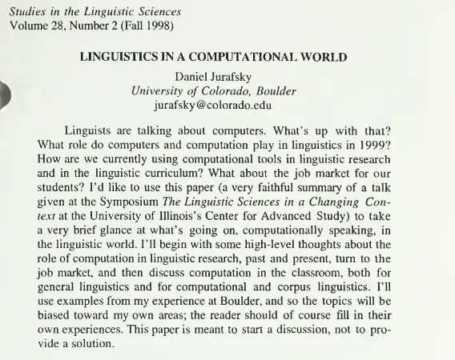
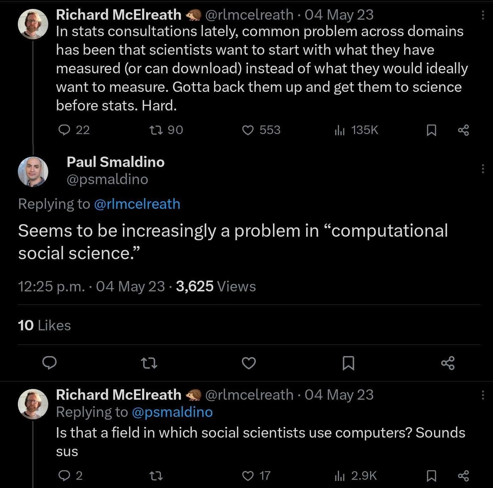

<style type="text/css">
.gallery {
  margin: 2rem -1rem;
  gap: 2rem;
  max-width: calc(840px + 2rem);
}

.gallery a {
  display: flex;
  flex-direction: column;
  align-items: center;
  gap: 0.5rem;
}

.gallery img {
  max-width: 100%;
  border-radius: 8px;
  box-shadow: 0 0 0 0.75px rgba(128, 128, 128, 0.2), 0 6px 12px 0 rgba(0, 0, 0, 0.2);
  aspect-ratio: 2500 / 1900;
}
.focus {
  color: var(--theme-foreground-focus);
}

.invert {
  background-color: var(--theme-foreground-alt);
  color: var(--theme-background);
}

.crop {
  border-radius: 8px;
  margin: 1rem;
  max-width: calc(50% - 2rem);
  box-shadow: 0 0 0 0.75px rgba(128, 128, 128, 0.2), 0 6px 12px 6px rgba(0, 0, 0, 0.4);
  aspect-ratio: 3024 / 1888;
  object-fit: cover;
  object-position: 0 100%;
}

.wbr::before {
  content: "\200b";
}

.wide {
  max-width: calc(100%);
  margin: 1rem;
  display: block;
  margin-left: auto;
  margin-right: auto;
}

figcaption code {
  font-size: 90%; /* TODO move to global.css */
}
/* 
Tabset  for alternative intro
 */

.tabset > input[type="radio"] {
  position: absolute;
  left: -200vw;
}

.tabset .tab-panel {
  display: none;
}

.tabset > input:first-child:checked ~ .tab-panels > .tab-panel:first-child,
.tabset > input:nth-child(3):checked ~ .tab-panels > .tab-panel:nth-child(2),
.tabset > input:nth-child(5):checked ~ .tab-panels > .tab-panel:nth-child(3),
.tabset > input:nth-child(7):checked ~ .tab-panels > .tab-panel:nth-child(4),
.tabset > input:nth-child(9):checked ~ .tab-panels > .tab-panel:nth-child(5),
.tabset > input:nth-child(11):checked ~ .tab-panels > .tab-panel:nth-child(6) {
  display: block;
}

/*
 Tabset Styling
*/

.tabset > label {
  position: relative;
  display: inline-block;
  padding: 15px 15px 5px;
  border: 1px solid transparent;
  border-bottom: 0;
  cursor: pointer;
  font-weight: 600;
}

input:focus-visible + label {
  outline: 2px solid rgba(0,102,204,1);
  border-radius: 3px;
}

.tabset > label:hover,
.tabset > input:focus + label,
.tabset > input:checked + label {
  color: #06c;
}

.tabset > label:hover::after,
.tabset > input:focus + label::after,
.tabset > input:checked + label::after {
  background: #06c;
}

.tabset > input:checked + label {
  border-color: #ccc;
  border-bottom: 1px solid #fff;
  margin-bottom: -1px;
}

.tab-panel {
  padding: 20px 0;
  border-top: 1px solid #ccc;
}


@media (prefers-color-scheme: light) {
  h1 {
    --theme-red: #d75c48;
  }
}


</style>

# The computational turn

<div class="gallery grid grid-cols-2">
  <figure class="gallery">
    <picture>
      <source srcset="./assets/jurafsky_comp_ling.webp" media="(prefers-color-scheme: dark)">
      
    </picture>
    <figcaption><a href="https://www.ideals.illinois.edu/items/11601/bitstreams/42397/data.pdf">Linguists are talking about computers. What's up with that?</a> Other references thinking out loud about this shift are this one on <a href="https://aclanthology.org/C96-2171.pdf">the use of computational linguistics in the real word</a><a href="https://www.dam.brown.edu/people/mumford/beyond/papers/2000b--DawningAgeStoch-NC.pdf">and Mumford's paper on The Dawning of the Age of Stochasticity</a> <a href="https://norvig.com/chomsky.html">and Norvig's post on the Two cultures of statistical learning</a></figcaption>
  </figure>
  <figure class="gallery">
    <picture>
      <source srcset="./assets/css_is_sus.webp" media="(prefers-color-scheme: dark)">
      
    </picture>
    <figcaption>A field in which social scientists use computers? Sounds sus?</figcaption>
  </figure>
</div>

Why make a big deal of scientists using computers? 

<div class="tabset">
  <!-- Generic intro -->
  <input type="radio" name="tabset" id="LostExplorers" aria-controls="LostExplorers" checked>
  <label for="LostExplorers">Lost explorers</label>
  <!-- GroupFirst intro -->
  <input type="radio" name="tabset" id="meaning" aria-controls="meaning" checked>
  <label for="meaning">Computer meaning</label>
  <!-- pannels -->
  <div class="tab-panels">
    <section id="LostExplorers" class="tab-panel">
      Consider the following analogy. In his 'lost European explorers' chapter, Joseph Henrich recounts the stories of technologically-advanced European explorers who spectacularly fail to survive in the Artic or the Australian outback because they lacked the local know-hows. As anthropologist, Henrich makes the point that huamns can thrive in harsh environments not because of our big brains having some innate modules, but by accessing a large bodies of culturally acquired knowledge. Our big brains are useful for learning from each others; leading to a ratchet effect where local populations can iterate cultural adaptations over many generations. This culturally acquired knowledge is complex, well-designed, adapted to local challenges, and often invisible to the unprepared eyes. <br><br> 
      As both of the authors above well know, the computational turn is not really about scientists using computers. The computational turn is about new tribes of scientists venturing into a new kind of cultural niche; one that is computational and that has been shaped by the local culture of hackers and other kinds of computer-savvy researchers. Doing computational works is multifacetted; ranging resource managements on high-performant clusters via  the command line, to write reproducible and transparent computer code.   <br><br> 
      In most cases, the new tribes of scientists are really like lost explorers. They lack local know-hows and cultural adaptations that make possible to thrive in this new environments. By failling to notice those local adaptations, and seeings computers as a simple tool, we make the computational much harder for some people than it could be. <br><br>
      Does it matter? Although scientists might not die of hunger as a results, we will show it can (i) increase unnecessary suffering in the academia, especially to early-career researchers, and explore how it might (ii) exacerbate gender biases in academia, what we will refer as the hidden costs of the computational turn. 
    </section>
    <section id="meaning" class="tab-panel">
      As both of the authors above well know, we will see that there are many reasons. 
      First, this is not really about computers, but what computers and computer programming mean for different communities. <br><br>
      In linguistics, computational methods are tied to a worldview about the study of languages.
      Say that you want to become a professor of linguistics in the 1990s. 
      As with other fields in the humanities, you learn to speak the native language.
      For instance, you might need to speak fluently in Chomsky's transformational-generative grammar, which states that grammar is a system of 'transformations', or processes, that specify the possible combinations of words in a sentence.
      By having a good grasp of these transformations, you can demonstrate to your peers that you are part of the tribe, potentially leading to a position in a linguistic department. <br><br>
      In his paper, Jurafsky mentions that the use of computers as tools does not really change the above. Using computer softwares to do phonetics or transcribe conversation doesn not change the worldview of linguistics. <br><br>
      Computers first pose problem when they introduce competing statistical methods to established linguistic theories that are successful due to their usefulness in industry. <br><br>
      The debate is epitomized by the dispute between Peter Norvig, now director of research at Google, and Chomsky, on whether statistical theory are providing any _theoretical_ insight into language. 
      Chomsky (in)famously stated that statistical theories are pointless to understand language because they fail to be mechanistics, unlike his theories (see [this transcript](http://languagelog.ldc.upenn.edu/myl/PinkerChomskyMIT.html)). 
      In many sciences, computational methods (often) do not reflect established theories thought to explain the phenomena by the natives but are still deemed successful, partly because success is defined by stakeholders outside the field.
      This idea is at the heart of why the computational turn is more than just about computers; it is cultural, epistemic and value-driven. <br><br>
      By changing what is deemed successful, the rise of computational works produce an [alternative stable state](https://esajournals.onlinelibrary.wiley.com/doi/10.1890/1540-9295%282003%29001%5B0376%3AASSIE%5D2.0.CO%3B2), as we will describe in the chapter on [computational hysteresis](./hysteresis.md). Key questions with stable states in conservation is about stability; how does one ecosystem, say forest, transitionned into another, savanah, given a shift in environmental drivers (Beisner et al. 2003). <br><br>
      Going back to our linguistic example, doing a PhD in linguistics in the Chomskian world involved developing a thesis about the fundamental properties of language, formulated with the vocabulary established in linguistics. Doing a PhD in linguistics in Norvig's world would involve splitting your time between learning enough linguistics to get you started, but also enough programming skills to wield larger corpora and do large scale analysis, typically useful to the tech industry that emerged with the informational era. One of our first questions is similar to that of conservationists; <br><br>
      > how does a shift in enviromental drivers, say academia being pressured to output quantifiable deliverable (CITE report), is impacting the coexistence of the Chomskian and Norvig's world. <br><br>
      Linguistics is not alone in that situation, albeit they might have been amongst the first in the humanities to undertake this transition. Digital humanities, computational social science, and cultural analytics are all meta-fields in search of their own identity, as they are expats from their own tribe. It is 'sus' that anthropologists are called something else when they start using computers. But if ever anthropology ends up becoming computationalized, what is the final outcome of this transition is still very much up in the air. This bring up the following question <br><br>
      > How can we, as communities, best reconcile the more traditional, qualitative works with hyped, and money-making computational works? How can science maintains methodological diversity with increasing pressure within, and outside, scientific communities to embrace computational works. <br>
      We note that the same phenomenon is happening in more experimental sciences, such as psychology, ecology, or biomedical engineering, where we observe a shift in which domain-specialists are somehow pressured to learn computer programming for various reasons. <mark class="red">I need to say more on this idea</mark> <br><br>
      We saw that the computational turn is more about the the meaning of the methods than with computers _per se_. A second reason to study the computational turn is that computational methods involve a skillset that is more or less easily attainable for researchers with different backgrounds, which has serious impact on the collective suffering and group dynamics of communities undertaking the computational turn.
    </section>
  </div>
</div>


## What makes the computational turn 'computational'

<div class="grid grid-cols-3">
  <div class="grid-colspan-2">
    We will delve in more depth in operationalize computational works in a <a href=./classify-comp-works.md>later section</a>, but for now we build a (heuristic) taxonomy of computational skills. We help visualizing all the bits of knowledge with the table of content of <a href="https://book.the-turing-way.org/">the-turing-way</a>, a online bNot all of layers might be required in a single project, but arguably most researchers stumble on a subset of those when dabbling with computational works. <br><br> Ask any computer-savvy researchers, they will tell you about how important it is to have good grasp of UNIX and Git to do computational works. On the one hand, all computing servers, most free and open-source programming libraries, and many computing routines are native to UNIX-based systems. On the other hand, any collaborative project requires version control history—as embodied by Git—to prevent collaborators stepping on each others' toes. <br><br> In the next three layers, we define software engineering skills that are emerging as key to conduct data-driven projects that are scalable, reproducible and transparent. We borrow the idea of amateur software engineering engineering from a <a href="https://www.youtube.com/watch?v=zwRdO9_GGhY&pp=ygURbWNlbHJlYXRoIGFtYXRldXI%3D">talk by Richard McElreath</a>, wher he argues for the importance of science doing more testing to ensure we limit the number of computer bugs in our works. Then, working with databases, Application Programming Interface (API), and extracting data from the web are all part of the skillset that are not that hard on their own, but can be time consuming for newcomers to do well. Finally, the idea of principled data processing originates from <a href="https://www.youtube.com/watch?v=ZSunU9GQdcI&t=1103s&pp=ygUacHJpbmNpcGxlZCBkYXRhIHByb2Nlc3Npbmc%3D">Patrick Ball</a>, who teach how to use project management skills and tools like Makefile to make a data-driven project reproducible on the long run. <br><br> At the top of the pyramid, we are getting closer to actual scientific works that are expected by most scientific domains today. Doing simulation, fitting models, as well as reading literature review to inform our modeling work with established theories.
  </div>
  <div> ${resize((width) => 
        plot_tree(turing_taxonomy, {width, height: 1500}))
    }
  </div>
</div>

## Hidden costs of the computational turn

<em class="red">TODO: Discuss diversity in science and tech + reproducibility and transparenty in science. Underlying the diversity in computational social science, discuss the fact of reducing overall suffering when dabbling with code. Maybe it is a good place to motivate that with the little prehistory of computer science.</em>


### Learning to code

Each layer of the CWHN requires something new to learn that are rarely taught in scientific curricula. Even in computer science, MIT computer science curricula added the "missing course in computer science" to teach many of those skills essential to industry but everybody ended up learning (often poorly) on their own.
 
### Man is to computer programmer as woman is to homemaker

Embeddings are very much clear evidence that there has been gender bias in how computer programming has been tied to men. The irony of it is that computer science is one of the only STEM fields that was more gender balanced at its inception than in more recent years. At some point, computers were for boys and not for girls (CITE). And perhaps more importantly, at some point programmers was a profession that made money to the industry. 

So many stories of hackers in the 1980s start with some dabbling with the Basic programming language, and leading to the free and open-source communities movement when stumbling on one of Richard Stallman's mythic stories or reading Eric Raymond's Cathedral and the Bazaar.

## So why study the computational turn?

Arguably, the following are good enough reasons to study the computational turn:

 - `Diversity in science`: it matters who do the science. If a science is becoming more male-dominated as a result of a computational turn, we should do something about it. There are reasons to believe this is the case.
 - `Reproducibility and transparency in science`: people who are not interested in good software engineering practice won't write code that is reproducible or transparent. 
 - `Reducing the suffering when dabbling with code`: writing dirty code is easy, writing code that your future selves and others will want to engage with is hard. If there is a lack of community when individual engage with computational works, it can have strong negative impact on individuals. Especially when individuals don't have a background in computing and engage reluctantly with ccomputaional works.
 - `Diversity in the tech industry`: it matters who build the tools that impact the scoiety at large. It is not enough to have oversight, we need a diversity of people in the tech industry as well at the level of software engineers. To get there, we need people from different socioeconomic and academic backgrounds that enter in the tech industry.

The computational turn has many benefits, but here we note the other side of the coin from a humanist perspective:

<div class="grid grid-cols-2">
    <div class="card"><h2>Dr Jekyll</h2>
        <li>Computational approach makes maths anb stats easier, sometimes even irrelevant.</li><br>
        <li></li>
    </div>
    <div class="card"><h2>Mr Hyde</h2>
        <li>Fields are can potentially becoming naturalized, which means they are more mathy. This can come with its own issues when the fields care about phenomenology, or the lived experience.</li>
        <li></li>
    </div>
</div>

## Groups and the computational turn

In the free and open source world, it is understood that many software projects are really about the community. The community is what make a project great or burn it to the ground. F/OSS is in large part responsible for the development of new collaborative tools that sustain the digital economy. It is about project management and having people working together on shared projects. F/OSS requires a whole new understanding of being a good citizen of the free and open source world. For example, by understanding the faux-pas of confusing open-source with free software. It more than just learning about the skills. 

Nowhere it is as obvious that, actually, science is a very individualistic enterprise than by comparing it with F/OSS. What do I mean by that? Isn't it science the most collaborative activity there is? Yes and no, but mostly no. Of course science is about collaboration. But when you thinking about it, so much of _academia_ is about personal feats, what we can call the 'heroic vision of science'. This is why we have laws named after individuals, even though most of the time they weren't really the ones who invented ([Stigler's law](https://en.wikipedia.org/wiki/Stigler%27s_law_of_eponymy)). Most awards and metrics are about individuals. In many domains, people are genuinly scared to be scooped because being the first one to make a discovery is what make you publish in prestigious journals, in turn making it possible to land a faculty position. 

All of this rise the following question; do the computational turn could significantly alter the individualistic tradition such that individuals who work as groups are favored, evolutionarily speaking? By that, can we test for the _multilevel selection hypothesis_, where people who work together outcompete groups who are less collaborative, either by differential reproduction, prestige-biased selection, or even migration across the border of science. 

The same argument can be made at institutional level. Do institutions who are able to adapt to this new reality will be favored, thereby spreading their practices to other, more conservative institutions. This strand of research is about the organizational contexts in which researchers and their groups evolve, either by providing labor advantage or having early start by having stronger digital instructure. 

All of that depend on how we define groups, collaboration, and institutions, which we do next.


```js
const turing_taxonomy = FileAttachment("./data/taxonomy/turing-way.json").json();
```

```js
function indent() {
  return (root) => {
    root.eachBefore((node, i) => {
      node.y = node.depth;
      node.x = i;
    });
  };
}
```
```js
function plot_tree(data, {width, height} = {}) {
  return Plot.plot({
  axis: null,
  inset: 10,
  insetRight: 120,
  marginLeft: 100,
  round: true,
  width: 300,
  height: 1300,
  marks: Plot.tree(data, {
    path: "name",
    delimiter: ".",
    treeLayout: indent,
    strokeWidth: 1,
    curve: "step-before",
    textStroke: "none"
  })
})
}
```