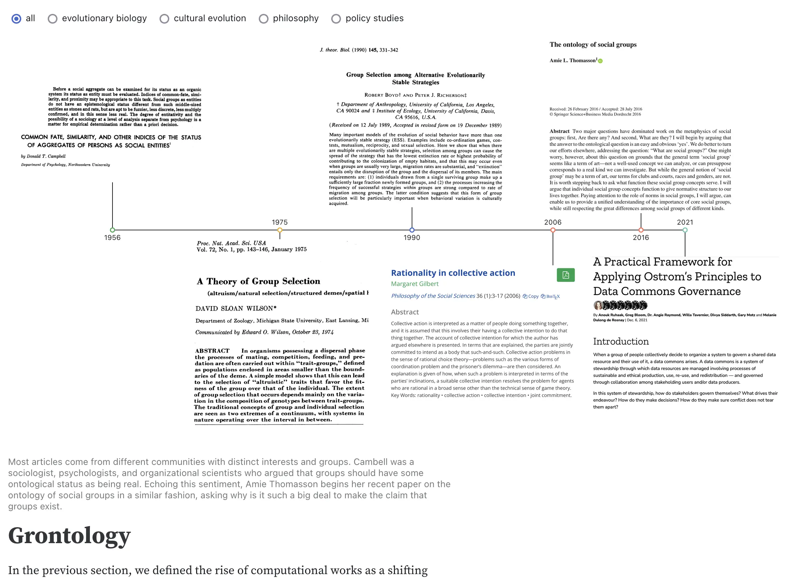

# Welcome
_This is an experimental project combining data collection, analysis, model building, narrative, and visualizations under the same roof, with a pinch of 'choose your own adventure' for people who get bored._

  <!-- Generic intro -->
  <input type="radio" name="tabset" id="GenericIntro" aria-controls="GenericIntro" checked>
  <label for="GenericIntro">Short intro</label>
  <!-- GroupFirst intro -->
  <input type="radio" name="tabset" id="GroupFirst" aria-controls="GroupFirst" checked>
  <label for="GroupFirst">Group-first intro</label>
  <!-- Tab 2 -->
  <input type="radio" name="tabset" id="tab2" aria-controls="introB">
  <label for="tab2">F/OSS intro</label>
  <!-- Tab 3 -->
  <input type="radio" name="tabset" id="tab3" aria-controls="introC">
  <label for="tab3">Non-meritocratic intro</label>
  <!-- pannels -->
  

    <section id="GenericIntro" class="tab-panel">
      But what are reseach groups? How do they impact our scientific works? Can groups  These are our big questions. We seek to define and characterize research groups in a practical ways while engaging with philosophical pedantries.
    </section>
    <section id="GroupFirst" class="tab-panel">
      Complex scientists are interested in how components of complex systems interact in non-trivial ways, giving rise to tipping points, emergence, and more generally collective phenomena. By using all sorts of models, it is possible to study a variety of systems under the same umbrella. Yet, in the face of complexity, we observe a common trend. At first, we take averages of systems, studying how systems behave at, or nearby, equilibrum states. In this regime, we add complexity by adding more features to individuals. 
    </section>
    <section id="introB" class="tab-panel">
        Free and open-source software (F/OSS) is changing how researchers collaborate on projects. As individuals increasingly rely on F/OSS, they are confronted with learning different tools and skills such as version control, interacting with API, or building principled data pipelines that are robust yet extensible. Learning about all of that can be scary. A solution to survive the process, once again, are communities.
    </section>
    <section id="introC" class="tab-panel">
        Non-meritocratic factors--institutional prestige, parenthood, subfields hype--is influencing academia in many ways. Evidence shows how institutional prestige is driving faculty hiring in computer science, business, and history, or how much of the scientific culture remains hostile to parenthood. Given data provenance and, as we will show, our WEIRD view of science (Western Educated Industrialized Rich and Democratic), most of this line of research has focused on individual researchers working in Phd granting institutions in STEM. Here we take a step forth in providing a view that is (i) group-based and (ii) more specific to the impact of computing on traditionally non-computational fields.
    </section>
  

    <a href="https://jstonge.observablehq.cloud/hello-research-groups/grontology" target="_blank">
      <picture>
        <source srcset="./assets/defining.webp" media="(prefers-color-scheme: dark)">
        
      </picture>
      
💡 Defining

    </a>
    <a href="https://joint-lab.observablehq.cloud/hello-gmes/" target="_blank">
      <picture>
      <source srcset="./assets/modeling.webp" media="(prefers-color-scheme: dark)">
        
      </picture>
      
🗺️ Modeling

    </a>
    <a href="https://jstonge.observablehq.cloud/hello-research-groups/results/timeline" target="_blank">
      <picture>
      <source srcset="./assets/measuring.webp" media="(prefers-color-scheme: dark)">
      
      </picture>
    
📊 Measuring

    </a>

## The philosophy of research groups

<figure>
  
  <figcaption>Fig. 142 The Turing Way community illustrated as a garden. The Turing Way project illustration by Scriberia. Used under a CC-BY 4.0 licence. DOI: 10.5281/zenodo.3332807.</figcaption>
</figure> 

In the project, we will include and exclude people from groups. Sometime this will feel unfair, as people will get excluded for seemingly arbitrary reasons. Truth be told, as research groups emerge and thrive, I think they become like the figure above; a loose network of people that can have more or less central cores. That being said, in current academia, many research groups are characterized by one or few principal investigators (PIs) who tie together a bunch of students under the same roof. 

When we are lucky, there is a public facing webpage hosted by the group/PI that says, "look, here is my lab". This will be the people we define as part of the group, even thoug some loose collaborators might be missing from that page. We assume that this approach is a good proxy to get who is on the payroll of the lab, or at least who benefit from being exhibited on the main page of the lab.

## Empirical challenges

<figure>
  
  <figcaption>Our estimand.</figcaption>
</figure>

 - _Measuring research groups_; their emergence/birth, deaths, composition (role specialization?), and size.
 - _Measuring the emergence of computational works_
    - As part of the rise of computational works, _measuring the emergence of F/OSS-driven works_ (aka caring about the intersection of good software-engineering practices and scientific ideals of reproducibility and transparency)
 - _Putting the two together_: measuring how  computational works impact the 'culture' of research groups. By culture, we mean collaboration norms at the moment, but really we would like to know how the rise of of computational works might endanger within- and inter-group diversity. That is, does the rise of computational works cause BIPOC researchers to leave academia at a faster rate at various career stage than not? 
    - Why would it be the case? 
      - Social identities involving computers are overly tied to (white) males, which mean that males are most likely (i) to have prior experience with computing and (ii) the intrinsic motivation to dive into the rabbit hole that is to learn computational thinking.
    - Different ways the replacement of non-computational to computational researchers can happen:
      1. `Non-computational groups trying to become computational`: in doing so, the composition within the group is changing (aka people in the groups willing to bite the bullett and learn to code are, on average, men).
      1. `Group selection`: non-computational/qualitative/traditional researchers are being replaced by computational groups via (non-violent) intergroup competition (aka prestige-biased, differential group survival without conflict, differential reproduction, differential migration). Group selection dynamics, it might be that non-comp researchers willing to have groups need more resources, and they will offspring more new researchers as output. If funding agencies/industry favor quantative science over more qualitative science, it might be good enough to see _computational hysterisis_. 

## Project philosophy

We are gonna build a collection of dashboards tied together by a common theme, that is, _characterizing research groups in science_. Similar to [Andy Matuschak's Evergreen Notes](https://notes.andymatuschak.org/Evergreen_notes), the central idea is to keep together a family of dashboards that will accrete over time. By analogy with Evergreen notes, each dashboard ought to be atomic, and 'concept-oriented' (answering a single question).

Note that it is easier to have many apps representing the data in different ways these days, thanks the [observable framework](https://observablehq.com/framework/what-is-framework) code design. Any observable project is basically a static site, for data apps. So one of the goals is to see if it works to create a new tab for each new way one could visualize the entire project. There is a chance it might gets out of hand, but I think if the data pipeline is well designed and it has the potential to scale up.

One reason not to do what we are about to do is _modularity_. Wouldn't be better to have the app living as a separate module? Then, the data wouldn't be tied to a single dashboard. It is possible, but one needs to overcome the following challenges:

- `Linking the data and the app:` One reason my dashboards end up dead is by forgetting where the data comes from. Then the app become frozen for eternity, as I simply move on to other projects. Wouldn't be better to have the app and the data pipeline coexisting under the same repo? 
- ...

---

## Roadmap

In this collection of notebooks, we examine interaction in patterns of collaboration and scientific paper publication. 
We are interested in finding how latent groups and collaboration in science are impacting the type of science we do.
We will define what we means by collaboration and computational and groups as we go along, but here is the roadmap.

_The rise of computational works_

We start by defining the rise of computational works in science. How science is becoming more computational everywhere, but not definitely not at the same rate. As such, this lay the groundwork for our empirical and modeling work.

_Epistemic inequality_

A small literature review on how non-meritocratic factors are influencing the scientific enterprise. The section lead to the central idea that the computational turn might significantly fuelled those non-meritocratic factors.

_Group ontology, or Grontology_

More and more people are claiming that science is now all about team. But really, how do most people operationalize teams? As set of coauthors. We think we can do better by integrating a bit of philosophy with modeling and data.

_Computational hysteresis in the social sciences_

A group-based model of how the computational turn showing how an increase in the group benefits of having programmers in your team might have important consequences for fields where the individual cost of learning to code is high.

### Methods

_Classifying computational works_

How can we quantify 'computational works'. This is harder than it seems.

### Results

_Researchers timeline: dual perspective of collaboration and productivity_

Individual scientific trajectory showing patterns of of publications and coauthorships:

On the left, each dot represents a coauthor, while on the right each dot represent a paper. 
The coauthor number is how many times <ins>ego</ins> (here [Laurent Hébert‐Dufresne](https://openalex.org/authors/a5035455593)) collaborated with that individual at all times.
The dot color represents whether there is shared affiliation between ego and the coauthor at that time.
We use a simple heuristics to determine affiliation; 
 - main affiliation is the institution that appears the most often in author's paper within a given year;
 - if coauthor and ego share their main institution, color with the same color.
Sometimes, we can have a good idea of ego's career trajectory by just looking at that information.
Here ego started at Université Laval, did a PostDoc at the Santa Fe Institute, then got a position at University of Vermont where we started his research lab.

Eyeballing the plot, there are definitely some similarities and differences. 
One similarity is Jean-Gabriel Young (JGY), who share the same lab than LHD, and exhibit similar patterns in collaboration early on.

_Patterns of collaboration_

What is it like to be a group.

### Appendix

_Overthinking field of study_

To claim that such or such a field is becoming computational, we need to define field of studies. This choice is not inconsequential.

### Extra works

_How proups fuelled creativity: exploring new semantic space (WIP)_

This has been removed for now. It will come back at some point.

We can also look at how the social and productivity trajectory correlate with topical exploration by ego. 
Here we use SPECTER2's <ins>scientific document embedding</ins> to look at how career trajectory maps onto topic exploration.
We can look at, for example, where did ego started by looking at his student's years:

Do the patterns observed in the previous section are typical? 
We can put side by side researchers, and start investigating the question. 
Here are 4 researchers in complex systems who are all under 11 years of academic age. 

We see that the early year was concentrated on the physics of network and some early epidemiology. 
We can compare early years with later years, where we already know he has new collaborations:

One of the most notable changes is how the ego is moving into computer science land. 
There are many reasons this might be the case. 
Part of it is due to ego's new PhD students that are more into computer science than physics or epidemiology.
The funding stream might be also a driver of that attraction towards that space.
There has been also foray into the intersection of climate change and public health.

#### Summarize database

This dashboard contains summary of the current data; it checks whether the annotated data is balanced, what are our different categories, and so on..

#### NSF Money

To fund groups, one needs money. One place researchers get money from is the NSF. 

#### NEH Money

To fund projects, one needs money. One place researchers get money from is the National Endowment of the Humanities. 

<!-- Yet another way to look at the change in collaboration patterns is to visualize collaborations as hyperedges:

Here, orange dots are coauthors with shared affiliation, as in the first figure. 
We only show papers with at least another person that share the same affiliation than ego, to focus on what we refer to as <ins>local works</ins>.
We can see that the collaboration patterns change drastically after 2019, but there might be competing causes.
We know ego became a professors at University of Vermont, but he is also involved heavily in epidemiological modeling.
As we know, 2019-2020 COVID-19 was in full swing. 

We can also see the degree to which ego's PhD was collaborative, with darker hyperedges indicating multiple collaboration with the same subset of coauthors.