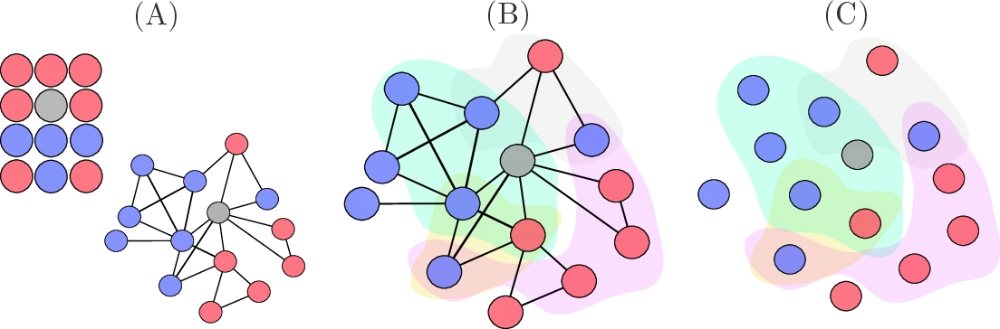
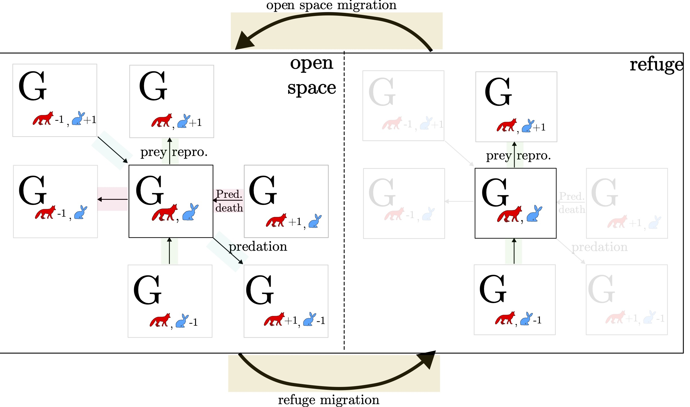
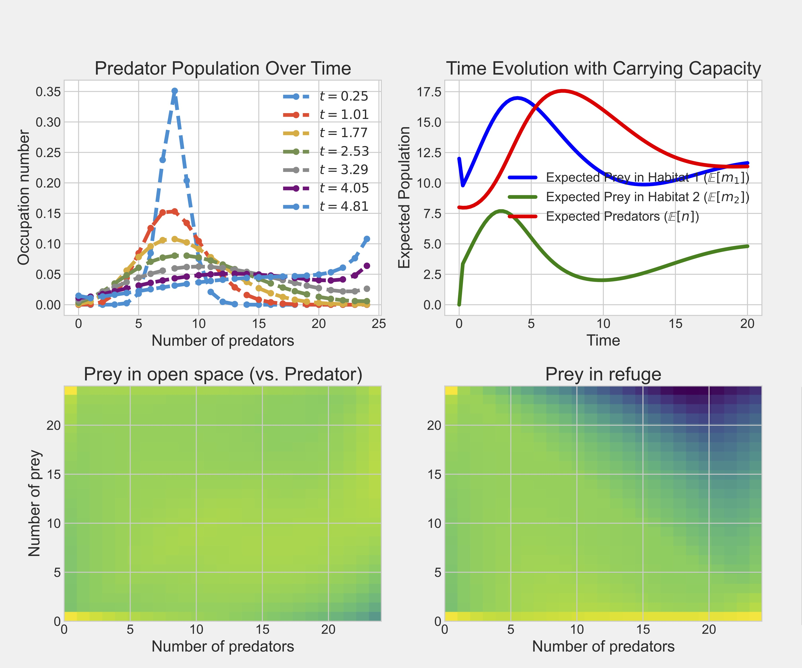
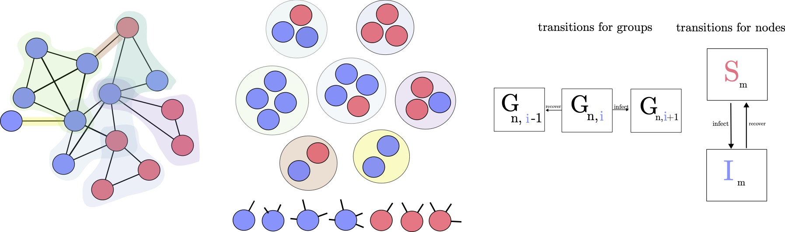

# Laboratory of group mind


> _This chapter serves as a short and friendly introduction to the formalism used throughout the thesis. As discussed in the introduction, a persistent tension runs through the social sciences: methodological individualists seek to explain social behavior by reducing it to individual preferences, beliefs, or values, while group realists argue that social groups possess irreducible properties that shape outcomes in their own right._

> _This tension reappears in modeling, though often in subtler ways. Schumpeter's focus on individual decision-making helped lay the groundwork for rational choice theory and game theory §[1.1](#sec.mf.intro). Meanwhile, social scientists inspired by Simmel's idea of duality used bipartite graphs to represent individuals and their affiliations. While such models acknowledge social context, they often treat groups as metadata on individuals rather than as entities with dynamics of their own. Hence, these models fail to capture the multiscale feedback between individuals and institutions, which could be thought of as a stronger reading of Simmel's duality._

> _One domain where this modeling tension is especially clear is the *problem of cooperation* (§[1.1.1](#sub.prob)). If evolution favors selfish individuals---whether rational agents or self-replicating genes---how does large-scale cooperation emerge, especially among unrelated individuals? A common answer is positive assortment: cooperators tend to interact more often with one another than with defectors. This thesis can be read as a modeling ontribution to that broader puzzle._

> _We close the chapter by introducing the master equation formalism used in Chapter [GroupSkills](./models/groupSkills.md), along with its group-based extension developed in Chapter [Coevo](./models/coevo.md)._

## Abstract 

We combine two families of models to explore the complexity of groups
and institutions; contagion models and evolutionary game theory models.
Both have recently been extended using hypergraph and approximate master
equation formalism to represent group dynamics. We first introduce
mean-field approaches, how they are used in evolutionary game theory,
before moving to (approximate) master equations.

## Mean-field theory

Many classical models of population biology, epidemiology, and the
social sciences rely on mean-field theory, which assumes that each part
of the system interacts only with the average or expected state of the
others---thereby ignoring structural and dynamical correlations. In this
approximation, local fluctuations and heterogeneity are smoothed out,
allowing for simpler, often analytically tractable models. A well-known
example is the Lotka-Volterra model, where predator-prey interactions
are modeled as random encounters between a predator population, ${tex`p`}, and
a prey population, ${tex`n`}, with interaction rates proportional to their
average population sizes
[@lotka_contribution_1909; @volterra_variations_1928; @rosenzweig_graphical_1963].
We can represent these modeling assumptions using compartments, where
each compartment tracks the size of a population, and the equations
describe the flow of individuals between them (see Fig.
[1.1](#fig:predator_prey)). We might think of ${tex`p`} as the Canadian
Lynx and ${tex`n`} as Hares in the following

```tex
\begin{align*}
                \dot{n} &= \mu n - \beta n p,   \\
                \dot{p} &= c \beta n p - \nu p.
\end{align*}
```

where ${tex`\mu`} is the rate of hare reproduction, ${tex`\beta`} is the rate at
which lynx consume hares, ${tex`c`} is a conversion factor of how many hares
are needed to support one lynx, and ${tex`\nu`} is the lynx's (natural) death
rate. Inspired by chemistry, one can think of a reaction happening at a
rate proportional to the system's average state, similar to how
stoichiometry determines reaction proportions. Mean-field theory extends
this idea by replacing individual interactions with an average
effect---like in the law of mass action, where reaction rates depend on
mean concentrations rather than tracking every molecule.

### The problem of cooperation

The prisoner's dilemma (PD) epitomizes how cooperation was problematized
in the social sciences. In classical games, the story is about a pair of
individuals who must *choose* their next move, weighing their choice
with an underlying *utility function* that specifies their preferences
over every action profile. Players are assumed to be consistent in
their utility functions and *knowledge of their opponent's strategy
options*. Beyond the story that we will not recite here, PD is about the
following (generic) payoff matrix


```tex
\begin{array}{c|cc}
                & \textbf{\textcolor{CoopColor}{Cooperate}} &
\textbf{\textcolor{DefectColor}{Defect}} \\ \hline
        \textbf{\textcolor{CoopColor}{Cooperate}} & A & C \\
        \textbf{\textcolor{DefectColor}{Defect}}    & B & D
        \end{array}
```

where ${tex`B > A > D > C`}. Indeed, say a cooperator, Alice, meets another
cooperator; she gets ${tex`A=b-c`}, where *c* and *b* are the costs and
benefits of the encounter's payoff, generally defined. But if Alice
meets a defector, say Bob, she pays a cost, ${tex`C=-c`}, while Bob gets
${tex`B=b`}. If both individuals defect, they both get ${tex`D=0`}. If ${tex`b=3`} and
${tex`c=2`}, we have ${tex`3 > 3-2 > 0 > -2`}, which effectively means that mutual
cooperation would be better than defection (as long as ${tex`3-2 > 0`}). Yet,
since each is considering what the other will do, Bob and Alice are
incentivized to defect (${tex`3 > 3-1`}). Since both players *believe* the
other will defect, and that ${tex`0 > -3`}, the only logical option is mutual
defection. In games where both players have no benefit from adopting
strategies besides mutual defection, the game is said to have a single
*Nash equilibrium* (there could be many). More precisely, since
${tex`3-2.5 > (3 - 2.5)/2`}, this is a *strict Nash equilibrium*, that is,
mutual cooperation performs better than the average of the payoffs when
one player defects and the other cooperates.

The Nash equilibrium is a simple mathematical result, but it has often
been interpreted as proof that self-interested individuals must be
tamed---since no one will unilaterally deviate from mutual defection
without external incentives [@smaldino_modeling_2023]. By "tamed", we
mean that later models showed how cooperation can emerge when agents
face punishment threats, such as state intervention. Although we now
know there are many ways out of the Prisoner's Dilemma, this line of
reasoning influenced scholars like Garrett Hardin in formulating the
*tragedy of the commons*: the idea that rational individuals will
overuse and deplete shared resources, such as fisheries or grazing land
[@hardin_tragedy_1968]. One could say that simple models of
rationality--by assuming selfishness--helped create their own tragedy:
shaping institutions that expect defection, discourage trust, and crowd
out local cooperation.

### The evolution of cooperation

Whereas classical games frame the problem of cooperation in terms of
strategies, rationality, and mind reading, evolutionary game theory
examines populations where behavioral strategies are inherited, and
individual fitness is determined by how common these strategies are
within the population. That is, evolutionary game theory is concerned
with situations where the consequence of a variable characteristic
depends on its frequency in the population, or *frequency dependence*.
**In this thesis, we will be particularly interested in how frequency
dependence in structured population importantly define the scope of
group interactions. Stated bluntly, group interactions can be thought as
the fitness of certain traits, not people, based on the joint influence
norms and individual psychology in a group-structured population.**

Evolutionary game theory is rooted in genetics, with alleles (or
genotypes) co-varying with heritable behavioral programs, or strategies
[@hamilton_genetical_1964]. A key simplifying assumption is that single
alleles code for behaviors. We will later discuss cultural variants,
typically transmitted through social transmission. Social learning can
occur in multiple directions---vertically (from parents to offspring),
horizontally (among peers), or diagonally (from relatives such as
uncles). Humans are unique in that individuals also adopt behaviors by
emulating those who are perceived as more successful or prestigious,
referred to as success- and prestige-biased transmission. But for now,
it is useful to understand where the notion of fitness comes from before
applying it to cultural systems. **In Chapter 4, we explore the
consequences of groups copying the institutions of more successful
groups, based on perceived fitness within a contagion context**

The replicator dynamics is a key result in evolutionary game theory that
will allow us to connect literature from cultural evolution with that of
public good games (PGGs) on networks

```tex
\Delta p    =    p(1 - p)        \frac{W(A) - W(B) }{\bar{w}}
```

where ${tex`W(A)`} is the combined fitness of strategy ${tex`A`}, which is the
product of survival ${tex`V(A)`} and the average number of zygotes ${tex`z(A)`} it
produces.[^3] The average fitness of the population is denoted as
${tex`\bar{w} = pV(A)z(A) + (1-p)V(B)z(B)`}. The replicator dynamics capture a
central concept in natural selection; variation is essential, and it is
maximized when ${tex`p=0.5`}. As we have seen, traits are inherited across
generations, making variation a crucial component of evolutionary
change. More generally, for a population with multiple strategies, the
change in frequency can be written as
${tex`\triangle p_i = p_i(\frac{W(i)}{\bar{w}} -1)`} (see the Appendix for the
full derivation). This equation illustrates that a trait with
above-average fitness will increase in frequency, while one with
below-average fitness will decline. The magnitude of the ratio reveals
that the rate of change in frequency is proportional to how much a
trait's fitness deviates from the population's mean fitness.

To illustrate the usefulness of the replication dynamics, consider the
following Hawk-Dove (or Snowdrift) game, where at each round a pair of
individuals fights over a non-divisible resource. In this case, the Hawk
and Dove strategies can be summarized with the following payoff matrix


```tex
\begin{array}{c|cc}
         & \textbf{\textcolor{DefectColor}{Hawk}} & \textbf{\textcolor{CoopColor}{Dove}} \\ \hline
        \textbf{\textcolor{DefectColor}{Hawk}} & \frac{V-C}{2} & V \\
        \textbf{\textcolor{CoopColor}{Dove}} & 0 & \frac{V}{2}
        \end{array}
```

where ${tex`V`} are the benefits of the resources and ${tex`C`} are the costs. When
a Hawk meets a Hawk, they fight and incur a cost ${tex`(V-C)/2`}, but when a
Hawk meets a Dove, it gains the full resource ${tex`V`}. Similarly, Dove meets
a Dove, they share the resources, but when a Dove meets a Hawk, it gets
nothing. We write the expected payoff for a Hawk as
$W(H) = p(V-C)/2 + (1-p)V`}, while the expected payoff for a Dove is
$W(D)=p(0) + (1-p)V/2`}. A central question in evolutionary game theory
is whether these strategies can coexist in the long run as evolutionary
stable states (ESS). The payoffs are linked to evolutionary fitness, as
higher payoffs result in passing down the strategies to subsequent
generations. To answer this question for a particular strategy, say
Hawk, we solve for all values of ${tex`p`} for which ${tex`p`} tends to increase

```tex
p\frac{V-C}{2} + (1-p)V    > p(0) + (1-p)\frac{V}{2}
```

A well-known result is that ${tex`p < v/c`}, that is, the Hawk population
dominates below a certain *relative* benefit-cost ratio. By the same
rationale, we find that Dove dominates when ${tex`p > v/c`}, meaning that
Hawk-Dove can coexist as an ESS when ${tex`p=v/c`}. This result is the same as
substituting the expected payoffs into the replicator dynamics equation
(with a constant mean fitness) and finding the equilibrium points for a
difference equation in one dimension.

### Positive assortment and complex networks {#sub.assort}

<figure id="fig:roadmap.game">

<figcaption>(A) Structured populations as local neighborhoods on a
lattice, modeling altruism emergence on complex networks <span
class="citation"
data-cites="nowak_evolutionary_1992 santos_scale-free_2005 ohtsuki_simple_2006"></span>.
(B) This led to the study of PGGs on graphs, where groups participate in
games derived from pairwise interactions <span class="citation"
data-cites="gomez-gardenes_evolutionary_2010"></span>. (C) Games as
higher-order interactions viewed as hyperedges <span class="citation"
data-cites="alvarez-rodriguez_evolutionary_2020"></span>, recognizing
different implementations based on the structure and dynamics of social
networks and groups.</figcaption>
</figure>

Both classical and evolutionary game theory suggest that randomness
tends to favor the greedy. In a sea of hawks, doves are at a
disadvantage. But if doves preferentially seek out other doves, they
gain a foothold---an effect known as positive assortment. Nowak & May
(1992) demonstrated a version of this in grid-based Prisoner's Dilemma
(PD) games, showing that cooperator clusters can emerge to promote
cooperation [@nowak_evolutionary_1992]. Yet, Hauert and Doebeli (2004)
later observed that spatial structure does not always enhance
cooperation; in a grid with uniform neighborhoods, a higher
cost-to-benefit ratio is required than in an unstructured population
[@hauert_spatial_2004]. These results motivated researchers to
investigate more realistic forms of social structures, including
heterogeneity in social contacts, to understand their impact on
cooperation [@santos_scale-free_2005; @ohtsuki_simple_2006].

In many real-world social networks, a small number of individuals have
disproportionately many connections, while most have relatively
few---producing a heavy-tailed degree distribution
[@simon_class_1955; @barabasi_emergence_1999]. To capture such
heterogeneity, one can group nodes into compartments based on shared
attributes (e.g., degree, but also social status, age group, or even
evolutionary strategy). Rather than tracking a single, fixed realization
of the network, an *annealed* approximation is often used, wherein links
are constantly reshuffled at a rate much faster than the dynamics of
interest (e.g., strategy updates or contagion). This constant
"reshuffling" of connections means we can effectively work with an
ensemble of possible networks that obey certain constraints, thus
reflecting these constraints on average, without being locked into any
one realization.

Under the annealed approximation, a random contact of a node in
compartment ${tex`i`} leads to a node in compartment ${tex`j`} with probability

```tex
\theta_{ij} = p_j k_j /  \langle k\rangle
```

where ${tex`p_j`} is the fraction of nodes in compartment ${tex`j`}, ${tex`k_j`} is their
average degree, and ${tex`\langle k\rangle = \sum_{m} p_m k_m`} is the mean
degree across all compartments. Because compartments with higher degrees
get proportionally more contacts, we capture how diverse connectivity
shapes the dynamics, yet maintain a mean-field perspective that avoids
simulating a single, static network. By tuning the constraints---e.g.,
specifying a degree distribution---modelers can systematically isolate
and analyze how this structural diversity impacts processes such as
cooperation, contagion, or information diffusion.

A well-known mechanism for generating skewed or power-law degree
distributions is the preferential attachment growth process
[@simon_class_1955; @barabasi_emergence_1999]. In this model, new nodes
are more likely to connect to already well-connected nodes, a
"rich-get-richer" phenomenon. One common form of the resulting degree
distribution is:

```tex
p_k = \frac{2m(m+1)}{k(k+1)(k+2)}
```

where ${tex`m`} is the number of links that each new node introduces upon
joining the network. For large ${tex`k`}, this distribution converges to a
power law:

```tex
k^{-\gamma} \quad \text{with }\gamma = 3,
```

since for large ${tex`k`}, we have ${tex`k+1 \approx k+2 \approx`}, and so the
demoninator behaves like ${tex`k^{-3}`}. In such scale-free networks, the
presence of highly connected "hubs" can effectively amplify strategy
spreading, bolstering positive assortment among cooperators
[@santos_scale-free_2005]. In evolutionary game contexts, these strong
correlations among individuals can facilitate the emergence of
cooperation. Indeed, there is a threshold condition ${tex`b/c>k`} (where ${tex`b`}
and ${tex`c`} are benefits and costs, respectively, and ${tex`k`} is the mean
degree) that characterizes when cooperation can invade
[@ohtsuki_simple_2006]. Scale-free structure thus makes it easier for
cooperative strategies to persist, given that large-degree nodes
spread---and reinforce---cooperation more effectively than they would in
more homogeneous networks.

### Limitations of the mean-field theory

All of the results so far rely on the mean-field assumption, which has
its limitations. First, when one population's fequency is too high
relative to the other, it can drive the other population to very low
levels. However, because the mean-field approach averages over the
entire population and assumes smooth, deterministic dynamics, both
populations can approach zero asymptotically without ever exactly
reaching zero. This occurs provided that the initial conditions and
model parameters are such that neither population collapses to zero
immediately. The smooth nature of these models does not account for
individual-level fluctuations or other factors that could lead to sudden
extinction.

Even though individuals interact on complex networks, modeling the
dynamics often assumes random mixing, where the interaction network is
reshuffled much faster than the unfolding of the dynamics. In this
framework, interactions are random, but the units involved can have
different characteristics that influence how frequently they interact
with each other. Because these interactions are reassigned at each time
step, the states of different units become independent over time,
"washing out" any correlations between their behaviors. For example,
even though Alice, Bob, and Trent might interact more often than others
due to their age, they may also form a tightly-knit clique, influencing
one another's states in nontrivial ways---an effect that the annealed
approximation fails to capture.

To better account for such local dynamical correlations arising from the
joint influence of individual node states and higher-order group
interactions, we turn to master equations. These equations track the
evolution of individual unit states while preserving information about
the structure of interactions within the network, offering a more
precise description of the system's dynamics than the mean-field
approach, which only considers averaged behaviors. In particular,
group-centered approximate master equations allow us to describe
group-based processes more accurately by shifting focus from individual
nodes to classes of groups, distinguished by their size and by the
number of cooperators within them.

## Modeling with the master equation

With master equations, we are concerned with the probability of the
system being in a specific configuration at any given time. That is,
rather than asking how the average number of cooperators or defectors
changes over time, we care about the full range of possible interactions
and how they evolve. For instance, having a configuration with five
cooperators and one defector is not necessarily equivalent to its
inverse. The exact arrangement matters: a lone defector among
cooperators might behave differently than a lone cooperator among
defectors. Master equations allow us to keep track of such distinctions.
As such, they are exact, in contrast to the group-based master equations
we introduce next.

We examine Weidlich and Haag's (1983) Lotka-Volterra master equation
model, which extends the prey-predator dynamics to include a refuge
habitat where prey are out of reach of predators (Fig.
[1.4](#fig:lv-schema))
[@haag_modelling_2017]. In this model, they show how the refuge habitat
contributes to modeling the instability of the Lotka-Volterra cycles
against perturbations, resulting in stable cycles instead of unstable
closed curves. The modeling of different habitats, and how we can model
the effect by taking into within--group composition, as well as the
influence of groups interacting with each other, will be a recurrent
theme in this thesis.

We represent the system as a time-dependent distribution over states
${tex`(n_1, n_2, p)`}, denoted by
${tex`\{G_{n_1,n_2,p}(t)\}_{n_1,n_2,p=0}^{\infty}`}. That is, we are concerned
with the probability of having ${tex`n_1`} in the open-space habitat, ${tex`n_2`}
prey in the refuge habitat, and ${tex`p`} predators. As such, master equations
are said to describe the time evolution of a system, as we can know the
probability of any combination of states at any given time (see Fig.
[1.5](#fig:haag)). We call
the *occupation number* the probability of finding the system in a given
state (or, alternatively, the fraction of "systems"), which influence
the "probability currents" of transitioning from one occupation state to
another adjacent state. One way to visualize such probability currents
is as follows

<figure id="fig:lv-schema">

<figcaption>Diagram of Weidlich & Haag’s master equation for the
Volterra-Lotka Model with an Refuge Habitat (1983). Here we indicate,
conceptually, the diffent interaction types that each arrow represents.
We can see that the probability flow in the open space can move from the
center compartment to the bottom right one by means of predation. That
is, we move from state with one few hares, but we gain one lynx. The
missing arrows and faded out compartments meant to represent impossible
transitions in the refuge habitat. </figcaption>
</figure>

In Fig. [1.4](#fig:lv-schema), each compartment represents a state of the
entire system. That is, each 'state' corresponds to different
configurations, or ensembles, of the (multiverse) system, allowing us to
model the probability distribution over all the possible configurations
of the system over time. As before, the model retains the same basic
information---predation, prey reproduction, and predator deaths---but
now we add more details. Specifically, we introduce two distinct
habitats in the system. These habitats may influence how the populations
interact, which will become important as we model the system's dynamics
in more depth. We provide the relevant bits from before but here written
as master equations

```tex
\frac{d}{dt}G_{n_1,n_2,p}^{\text{(BD-out)}} = \Big[
    
        \mu n_1 (K - n_1) - \mu n_2(K - n2)
    
    - 
        \nu p
    
    \Big]
    
        G_{n_1,n_2,p}(t)
```

But master equations are all about balancing our equations so that we
have *normalization* and *conservation* of our densities. That is, our
set of differential equations respects the
${tex`G_{n_1, n_2, p}(t) \in (0,1) \;\forall \in \mathcal{N}`} as well as
${tex`\sum_{n\in N} G_{n_1,n_2,p}(t) = 1 \;\forall t \rightarrow \sum_{n\in N} \frac{d}{dt}(t)=0`},
respectively. In our equations, it means that what we output with our
output probability current (arrows going out) should be balanced with
some input currents:

```tex
\begin{split}
    {
        \frac{d}{dt}G_{n_1,n_2,p}^{\text{(BD-in)}}
    }
    &=
    {
        \mu (n_1 -1) (K - n_1 + 1)
    }\  \\
    &+ {
        \mu (n_2-1)(K - n_2 + 1)
    }\  \\
    &+ {
        \nu p
    }\ 
    \end{split}
```

We do the same work for the other parts of the model in the appendix.
The important thing is that in the end, we can combine the different
parts of the model to get the following master equation:

```tex
\frac{d}{dt}G_{n1,n2,p}(t)
  = \frac{d}{dt}G_{n_1,n_2,p}^{(\text{Mig})}(t)
  + \frac{d}{t}G_{n_1,n_2,p}^{(\text{Pred})}(t)
  + \frac{d}{dt}G_{n_1,n_2,p}^{\text{(BD)}}(t)
```

In figure [1.5](#fig:haag),
we visualize the systems by either looking at the time dynamics (top
rows) or examining the systems at equilibrium (bottom row). The upper
left figure demonstrates what is meant by time evolution dynamics, where
we can see how the states with 25 predators in the system are becoming
increasingly more likely over time. In the upper right figure, we plot
the expectation for the different populations, showing

<figure id="fig:haag">

<figcaption>Summary of time evolution and equilibrium state space. Upper
left: Time evolution plot showing how the occupation number (probability
of a state with a certain number of predators) changes over time
(indicated by colors). Upper right: The mean-field of master equations
is recovered by taking the population expectations, illustrating the
traditional prey-predator cycle. Bottom: We inspect probability
distributions of prey in different habitats, going beyond simple
averages. This approach allows us to model extinction events in discrete
environments, where populations can transition to zero.</figcaption>
</figure>

With the probability distributions in hand, we can calculate, for
instance, the expected population in the open space habitats by summing
over the entire probability distribution
${tex`\mathbb{E}[n_1] = \sum_{n_1,n_2,p} n_1 \cdot G_{n_1,n_2,p}(t)`} (upper
right quadrant). But this is a computationally expensive process; for
simple binary dynamics, it implies ${tex`2^N`} possible states for the
systems. For Weidlich and Haag's model, it culminates into ${tex`9,126`}
possible states, meaning that we need a system with that many coupled
ODEs. Alternatively, and more conveniently, we can apply the method of
moments to derive an approximate system of ODEs governing the evolution
of key statistical moments of the distribution. But our real goal is for
the formalism to capture the uniqueness of human group behaviors. To
this end, we coarse-grain the dynamics at the mesoscopic level, opening
the door to modeling group interactions while preserving crucial
details---namely, how individual behavior is shaped by group composition
in non-trivial ways. We are willing to trade off the exactness of the
master equation in favor of group-based approximations more relevant to
social systems.

<figure id="fig:lv_ame">

<figcaption>A simple group-based master equations of cooperation. On the
left, we have the same example of a complex networks as before, but here
we identify higher-order cliques (or motifs, or hyperedges) present in
the graph. They represent relevant subunits, which can shared contexts
or social groups, and count towards the number of group equations in our
system. In group-based models, we also track nodes based on their state
and the number of groups they belong to. In this case, we have 7 member
equations, based on how many nodes in a given state and membership <span
class="math inline"><em>m</em></span>. In the schema, we abstract away a
specific realization of our network to focus on the probability
distribution <span
class="math inline"><em>G</em><sub><em>n</em>, <em>i</em></sub></span>
of groups with size <span class="math inline"><em>n</em></span> and
<span class="math inline"><em>n</em> ≤ <em>i</em></span> cooperators.
Alongside the group dynamics, we represent a very simple SIS dynamics
based on generalized degree <span class="math inline"><em>m</em></span>
(group membership). Practically, within each group, we can have
nonlinear effects based on group composition, whereas the relationship
among groups can be represented as mean-field (annealed formalism).
</figcaption>
</figure>

## Group-based master equations

By coarse-graining our set of master equations around relevant subunits,
we reduce the system's dimensionality while preserving its core
dynamics. We distinguish between equations for individual
members---capturing transitions between states within groups--and
equations for the groups themselves--tracking how entire group
configurations evolve over time. In Fig.
[1.6](#fig:lv_ame),
subunits are shown as circles, which may represent cliques or
hyperedges. For instance, we can write 7 member equations to model the
internal interactions among group members. These provide a more
fine-grained description of the system, whereas group equations
summarize how group-level states evolve. We refer to this formalism as
group-based master equations (GMEs), in contrast to node-centered master
equations where the approximation depends on the states of nodes and
their neighbors [@marceau_adaptive_2010].

Building on previous work on approximate master equations
[@hebert-dufresne_propagation_2010; @st-onge_master_2021; @st-onge_influential_2022],
we extend beyond traditional two-species dynamics (e.g., prey-predator
models) to group-based contagion, where individuals transition between
Susceptible and Infected states (SIS dynamics). Unlike mean-field models
that wash out correlations between individual states, GMEs preserve the
exact composition of each group during contagion. This is crucial in
settings like airborne virus spread within households or workplaces,
where repeated exposure and shared environments lead to strong local
reinforcement and non-linear transmission effects.

Coupling between groups arises naturally when individuals belong to
multiple groups, creating pathways for contagion or influence to spread
indirectly across the system. Originally introduced to model
context-dependent contagion [@hebert-dufresne_propagation_2010], this
approach has since been applied to settings such as policy co-evolution
and collective behavior [@hebert-dufresne_source-sink_2022]. In our
framework, such overlap induces dynamic coupling without requiring
direct group-to-group interactions--capturing the essence of coupling
from our typology in the [Interface](./models/interface.md) chapter

```tex
\begin{equation}
\begin{split}
    \frac{dS_m}{dt}
    &= -m \theta(t) S_m(t) + \mu \big(1 - S_m(t)\big) \\
    \frac{dG_{n,i}}{dt}
    &= -(n - i)\beta(n, i)\, G_{n,i}(t)
    - (n - i + 1)\beta(n, i - 1)\, G_{n,i-1}(t) \\
    &\quad - \mu i\, G_{n,i}(t)
    - \mu(i + 1)\, G_{n,i+1}(t) \\
    &\quad - (n - 1)\phi(t)\theta(t)\, G_{n,i}(t)
    + (n - i + 1)\phi(t)\theta(t)\, G_{n,i-1}(t)
\end{split}
\end{equation}
```

We highlight the different places where infection occurs in pink. First,
we have the within-group contagion, with the infection rate ${tex`\beta(n,i)`}
proportional to the number of susceptible individuals in the group
(assuming that groups are of size ${tex`n`}, so that ${tex`n-i`} is the number of
susceptible individuals within the group). As before, our master
equation must respect the in-flow and out-flow of groups coming into
state ${tex`G_{n,i}`}, based on mechanisms of infection. In the original
paper, the infection rate is defined as a non-linear function of the
number of infected individuals ${tex`i`} in the group, or
${tex`\beta(n,i) = \lambda i^\nu`}. Second, note that infection also occurs on
the first line of equation
below, which is an approximation of the
fractions of infected nodes of membership *m*. As such, ${tex`S_m`} is treated
as a mean field, considering the dynamic correlations between pairs of
node-groups (here, nodes in the sense that it refers to the hyperdegree
of a node, or the number of groups to which the node belongs). Together,
these terms allow us to capture both local (within-group) and global
(across-group) mechanisms of infection and recovery, reflecting the
multi-scale dynamics typical of real-world group-based contagion.

We have one more place where infection takes place, but this time it
happens in the ether (or the mean-field)

```tex
\begin{equation}
\begin{split}
    \theta(t) 
    &= \frac{
        \sum_{n,i} (n - 1)\beta(n, i) \, G_{n,i}(t)
    }{
        \sum_{n,i} \beta(n, i) \, G_{n,i}(t)
    } \\
    \phi(t) 
    &= \frac{
        \sum_m (m - 1)m \, S_m(t)
    }{
        \sum_m m \, S_m(t)
    }
\end{split}
\end{equation}

```

On one hand, ${tex`\theta(t)`} represents the average infection rate due to
the mean-field of groups (i.e. on average, how much of the global
population is infected), while ${tex`\phi(t)`} represents infections due to
expected excess memberships of susceptible nodes (on average, how many
infections come from a node having multiple memberships). Although this
contributes to the infection, we highlight that this part of the
approximation appears in purple (showing up in the last line of the master equation above), where we combine the state transitions
of the susceptible nodes in a group due to their membership in other
groups, which are modeled via the mean-field quantity
${tex`\phi(t)\theta(t)`}. In green, we highlight the transitions corresponding
to recovery events, which occur at rate ${tex`\mu`} and are proportional to
the number of infected individuals ${tex`i`}.

GMEs provide a more accurate description of spreading processes when
contagion depends not only on individual interactions but also on the
internal dynamics of groups and how those groups are intertwined. When
group sizes are heterogeneous and contagion is superlinear (i.e.,
$\nu > 1$), the system can exhibit mesoscopic localization: large groups
disproportionately drive contagion, lowering the epidemic threshold.
This can create hysteresis--where the long-term infection level depends
on whether the outbreak began from a small or large seed. In real-world
data (e.g., face-to-face contact networks), this implies that early
momentum can lock in high infection levels, even if conditions later
become unfavorable. Unlike annealed approximations, GMEs assume a
quenched group topology--one that remains fixed as dynamics
unfold--allowing the model to capture strong within-group correlations
and persistent group influence. Groups here may represent contexts where
local coordination shapes global dynamics, such as classrooms, teams, or
households.

In this thesis, we build on those ideas by combining generalized master
equation models with evolutionary game theory, applied to group
dynamics. Here, instead of modeling contagion directly, we consider a
population of ${tex`m`} groups playing PGGs, where outcomes depend on
trade-offs between individual costs and collective rewards. Importantly,
we introduce institutions as explicit actors that collect and
redistribute tokens---capturing how institutional policies shape group
behavior. One can think of the system as a "multiverse" where all groups
play PGGs simultaneously, influencing one another but under differing
local conditions set by policy. As in the contagion model, individuals'
behaviors are shaped by their group memberships, but now the
heterogeneity comes from the variation in institutional rules rather
than infection parameters. While we do not explicitly model the rewards
players receive, we infer them through their willingness to
contribute---cooperation emerges as a function of observed behavior and
institutional context. Each group thus acts as a localized game, where
players decide whether to cooperate based on what others are doing and
how valuable the public good appears to be. **In Chapter
[Interface](./models/interface.md), we discuss a model in which the
incentive to cooperate also depends on the perceived quality of the
public good---a crucial feedback often neglected in the existing
literature**.

<!-- [^1]: Hence the name Rational Choice Theory to refer to classical games;
    utility functions over set of actions is taken to be a
    representation of rational behaviors.

[^2]: You may think of it as reduced jail time, if you like.

[^3]: This form highlights the importance of the variance genotype in
    describing fitness. See
    §[\[appendix.rep\]](#appendix.rep){reference-type="ref"
    reference="appendix.rep"} for the more general form of how growth
    rate is proportional to the difference between the fitness of a
    strategy and the average fitness. -->
